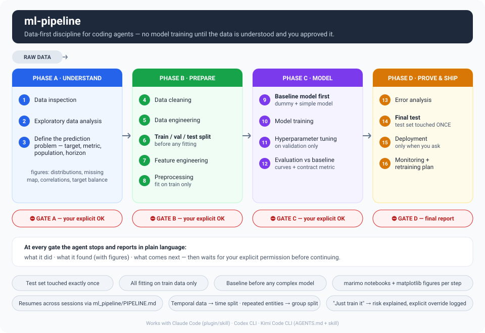

# ml-pipeline

**Stop your coding agent from jumping straight to model training.**

Coding agents love to call `.fit()` five minutes into an ML task — before looking at the
data, before there's a test set, before anyone agreed on what is being predicted. This
plugin forces a strict, data-first 16-step pipeline with explicit user-permission gates —
and, in Claude Code, a hook that makes skipping them impossible:



## Install

**Claude Code**

```
/plugin marketplace add jananthan30/ml-pipeline
/plugin install ml-pipeline@ml-pipeline
```

The skill activates automatically on any ML training/tuning/evaluation task, or invoke it
directly with `/ml-pipeline`.

**Codex CLI**

```
codex plugin marketplace add jananthan30/ml-pipeline
codex plugin add ml-pipeline@ml-pipeline
```

**Kimi Code CLI** (or Codex without plugins)

```bash
git clone https://github.com/jananthan30/ml-pipeline && cd ml-pipeline && ./install-other-tools.sh
```

Copies the skill into `~/.codex/skills/` and `~/.kimi-code/skills/` and appends an
enforcement section to each tool's global `AGENTS.md`.

## How it works

- **Strict order, no skipping** — the split happens *before* feature engineering and
  preprocessing; all fitting uses training data only; the test set is touched exactly once.
- **You stay in control** — at each gate the agent explains, in plain language, what it
  did, what it found (with figures), and what comes next, then waits for your explicit OK.
  "Just train it" gets the risk explained and requires a logged override.
- **See everything** — [marimo](https://marimo.io) notebooks as the workbench, matplotlib
  figures saved to `ml_pipeline/figures/`, each explained in 1–2 plain sentences.
- **Resumable** — `ml_pipeline/PIPELINE.md` tracks every step and approval, so a new
  session continues where the last one stopped.

## Enforced, not just instructed

In Claude Code the plugin ships hooks. Before any command, file write, or notebook edit runs, a
`PreToolUse` hook scans the code and **denies**: any fitting before Gate A; model training before
Gate B; evaluating on the test split before Gate C; fitting on the test split, ever. A denied call
tells the agent exactly which steps are missing — so "just train it" fails closed until you have
approved the gate. A `PostToolUse` hook warns when a metric looks too good to be honest or a split
ignores class balance or time. And at step 6 the agent switches to `guard.split()` /
`guard.final_test()`, a small runtime library that drops duplicates, refuses random splits on
temporal data, and lets the frozen test set be scored exactly once.

It also refuses to let understanding be skipped. `guard.profile()` writes a data profile — column
kinds, missingness, duplicates, class balance, temporal coverage, and **leakage suspects** — and
`guard.eda_figures()` draws the required figures with explanations computed from the data. Gate A
can't be recorded without them; Gate B can't be recorded without a written model rationale (traits
→ baseline → candidates → what was ruled out and why → metric). And five provably wrong applications
are denied outright from the profile: a neural net on a small table, a random split on temporal
data, a non-group split on grouped data, accuracy as the selection metric on an imbalanced target,
and resampling before the split.

Prove it on the **canary**: `examples/canary/canary.csv` has a known honest ceiling of 0.80
accuracy. Beat it and you leaked. `ML_PIPELINE_ENFORCE=0` switches enforcement off for non-ML
projects. Codex and Kimi get the same rules as instructions (no hook support there).

## License

Apache-2.0
